# CameraFocus - DOCUMENTATION

## 1. Genel Bakış

### Paketin amacı ve ne yaptığı

CameraFocus paketi, bir IP kameraya doğrudan bağlanarak görüntünün odak (netlik) kalitesini ölçen ve gerektiğinde kameranın **odak ve zoom** motorlarını süren bir "component" paketidir. Paket:

- Kameranın canlı videosunu **ONVIF** üzerinden kendisi çeker (ayrı bir video kaynağı bileşenine gerek yoktur)
- Klasik iki odak ölçüsünü (Brenner ve Tenengrad) hesaplar ve sayısal skor üretir
- Profesyonel kamera yardımlarını görüntü üzerine çizer: focus peaking, zebra pozlama uyarısı, HUD, kompozisyon ızgarası, merkez işareti
- Opsiyonel olarak gelen nesne tespitleri için **bölge bazlı** odak skoru üretir
- Kameranın odağını üç ayrı modda kontrol eder: manuel, kameranın kendi tek-tuş otofokusu ve pakete ait **kapalı-döngü otofokus**

### Temel özellikler

- ✅ ONVIF üzerinden markadan bağımsız kamera bağlantısı (video + kontrol)
- ✅ İki odak ölçüsü: Brenner ve Tenengrad
- ✅ Görselleştirme katmanları (focus peaking, zebra, HUD, grid, merkez işareti)
- ✅ Bölge bazlı (bounding box) odak ölçümü
- ✅ Odak ve zoom kontrolü (mutlak konumlandırma)
- ✅ Tenengrad skorunu maksimize eden kapalı-döngü otofokus
- ✅ Lens dışarıdan oynatıldığında otomatik yeniden odaklanma
- ✅ Kamera yeteneklerinin (zoom/odak/otofokus) otomatik tespiti
- ✅ Pydantic tabanlı model tanımları (girdi/çıktı/konfigürasyon)

### Desteklenen sınıflar / modeller / tipler

| ID | İsim | Açıklama |
|----|------|---------|
| 1 | `CameraFocus` | Paketin tek executor sınıfı — kameraya bağlanır, ölçer, kontrol eder |
| 2 | `PackageModel` | Paket genel yapı tanımı (configs, executor) |
| 3 | `Mode` | Çalışma modu seçimi: Brenner / Tenengrad / Stream |
| 4 | `FocusMeasures` | Brenner ve Tenengrad odak ölçüsü hesaplayıcıları |
| 5 | `OverlayRenderer` | Tenengrad görselleştirme katmanları |
| 6 | `Visualization` | Brenner odak haritası çizimi |
| 7 | `OnvifBackend` | ONVIF üzerinden kamera kontrolü (video URI, odak, zoom, durum) |
| 8 | `CameraBackend` | Kamera kontrol arayüzü (soyut) |
| 9 | `CameraController` | Video okuyucu + kontrol backend'ini birleştiren cephe sınıfı |
| 10 | `RtspReader` | Arka planda çalışan, daima en güncel kareyi tutan RTSP okuyucu |
| 11 | `AutofocusController` | Kapalı-döngü otofokus (tepe tırmanma) mantığı |
| 12 | `InputGate` | Girdi normalizasyonu (her kareyi 2B uint8 gri tonlamaya çevirir) |

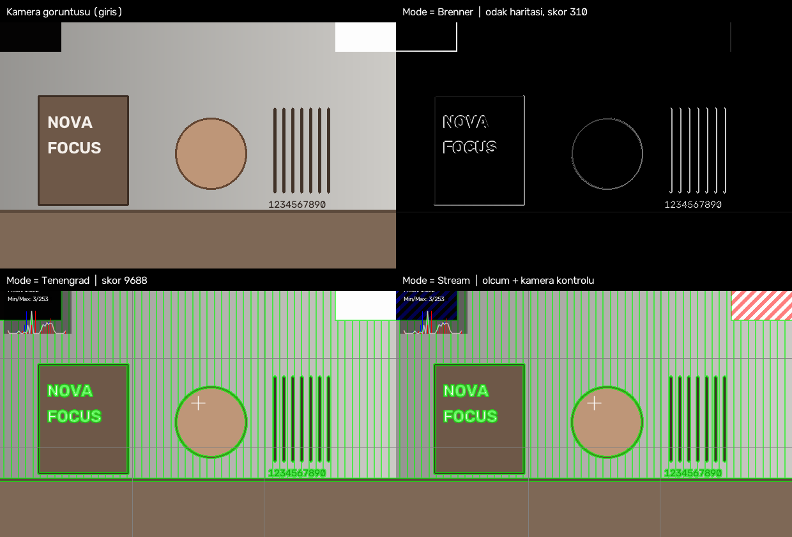

**Şekil 1.** Aynı kare üzerinde üç mod: ham görüntü, Brenner odak haritası, Tenengrad katmanları ve kamera kontrolünü de içeren Stream modu.

---

## 2. Mimari ve Teknolojiler

### Teknoloji Stack'i

- Framework: Python 3.x
- Veri Yönetimi: Redis (SDK'nın `Image.get_frame` / `set_frame` fonksiyonları üzerinden)
- Görüntü İşleme: OpenCV (cv2), NumPy
- Kamera Protokolü: ONVIF (`onvif-zeep` veya `onvif-zeep-async`), RTSP
- HTTP: requests
- SDK Bileşenleri: `sdks.novavision` (Component, Image, PackageHelper, Executor)

### Her teknolojinin rolü ve kullanımı

- **Python 3.x**
  - Rol: Ana programlama dili
  - Kullanım: Paket mantığı, Pydantic modeller, kontrol döngüsü

- **OpenCV (cv2)**
  - Rol: Görüntü işleme ve video okuma
  - Kullanım: Sobel gradyanı, Gauss filtreleri, RTSP akışının çözülmesi (`VideoCapture`), katmanların çizimi

- **NumPy**
  - Rol: Dizi tabanlı hesaplama
  - Kullanım: Odak matrisi hesabı, yüzdelik eşik, histogramlar, yerinde (in-place) işlemler

- **ONVIF (onvif-zeep / onvif-zeep-async)**
  - Rol: Markadan bağımsız kamera kontrolü
  - Kullanım: Media servisinden RTSP adresinin keşfi, PTZ servisinden zoom, Imaging servisinden odak ve otofokus

- **RTSP**
  - Rol: Canlı video akışı
  - Kullanım: `RtspReader` arka plan iş parçacığı ile daima en güncel karenin tutulması

- **Pydantic**
  - Rol: Girdi/çıktı/konfigürasyon şeması ve doğrulama
  - Kullanım: `PackageModel.py` içindeki tüm modeller

- **sdks.novavision**
  - Rol: Paket geliştirme altyapısı
  - Kullanım: `Component` sınıfı, `Image.set_frame` ile karenin Redis'e yazılması, `PackageHelper` ile cevap üretimi

### Proje yapısı

```
CameraFocus/
├── LICENSE                                  # Lisans bilgisi
├── README.md                                # Kısa proje açıklaması
├── setup.py                                 # Paket kurulumu ve bağımlılıklar
├── apps/
│   └── client.py                            # Platformsuz çalıştırma için istemci
├── notebooks/                               # Deneysel çalışmalar
├── resources/
│   └── report/                              # Bu doküman ve rapor görselleri
├── tests/                                   # Test kodları
└── src/
    ├── classes/
    │   ├── AutofocusController.py           # Kapalı-döngü otofokus (tepe tırmanma)
    │   ├── CameraBackend.py                 # Kamera kontrol arayüzü (soyut)
    │   ├── CameraController.py              # Okuyucu + backend cephesi
    │   ├── FocusMeasures.py                 # Brenner ve Tenengrad ölçüleri
    │   ├── InputGate.py                     # Girdi normalizasyonu
    │   ├── OnvifBackend.py                  # ONVIF kontrol uygulaması
    │   ├── OverlayRenderer.py               # Tenengrad görselleştirme katmanları
    │   ├── RtspReader.py                    # Arka plan RTSP okuyucu
    │   └── Visualization.py                 # Brenner odak haritası
    ├── configs/                             # Yapılandırma dosyaları
    ├── executors/
    │   └── CameraFocus.py                   # Executor: parametre okuma ve akış yönetimi
    ├── models/
    │   └── PackageModel.py                  # Pydantic modeller
    └── utils/
        └── response.py                      # Cevap oluşturma yardımcısı
```

Açıklamalar:

- `CameraFocus.py` — İnce bir adaptördür: parametreleri okur, kareyi alır, seçilen moda göre ölçüm/çizim yapar ve Stream modunda kamerayı sürer. Algoritma barındırmaz.
- `PackageModel.py` — Girdi, çıktı, konfigürasyon, request/response ve executor tanımları.
- `src/classes/` — Tüm algoritma, çizim ve kamera iletişimi mantığı burada, saf ve test edilebilir biçimde tutulur.
- `utils/response.py` — Executor bağlamından birleşik cevabı üretir.

### Katmanlı mimari

```
Platform (NovaVision)
        │  request / response
        ▼
CameraFocus (executor, ince adaptör)
        │
        ├── CameraController ── RtspReader ──── RTSP  ──▶ Kamera (video)
        │                   └── OnvifBackend ── ONVIF ──▶ Kamera (odak / zoom / durum)
        │
        ├── FocusMeasures (Brenner, Tenengrad)
        ├── Visualization / OverlayRenderer (çizim katmanları)
        └── AutofocusController (kapalı-döngü otofokus)
```

---

## 3. Executor'lar ve Çalışma Modları

### `CameraFocus` (Tam path: `src/executors/CameraFocus.py`)

- Amaç:
  - IP kameradan canlı kareyi alıp odak kalitesini ölçmek, görselleştirmek ve seçilen moda göre kameranın odak/zoom motorlarını sürmek.

- Kullanım senaryosu:
  - ✅ Kamera kurulumunda ve kalibrasyonunda odak kalitesinin sayısal doğrulanması
  - ✅ Bulanık kamera akışlarının otomatik tespiti ve izlenmesi
  - ✅ Uzaktan odak/zoom ayarı ve otomatik odaklama
  - ✅ Nesne bazlı odak analizi (tespit kutuları ile birlikte)

- İşleyiş (numaralı adımlar):
  1. `bootstrap(config)` boş sözlük döner; kalıcı kamera bağlantısı ve otofokus durumu `run()` içinde tembel (lazy) oluşturulup bootstrap sözlüğünde saklanır.
  2. `run()` çağrısında kimlik bilgileri kontrol edilir; eksikse kamera hiç yoklanmaz (kameranın hesabı kilitlemesini önlemek için).
  3. `CameraController.read_frame()` ile arka plan okuyucudan **en güncel** kare alınır.
  4. Seçilen `Mode` değerine göre:
     1. **Brenner** → `FocusMeasures.brenner()` + `Visualization.render_brenner()`
     2. **Tenengrad** → `FocusMeasures.tenengrad()` + `OverlayRenderer.render()`
     3. **Stream** → Tenengrad ölçümü ve katmanları + kamera kontrolü
  5. Stream modunda kamera kontrolü ve durum okuması **arka plan iş parçacığında** yürütülür; böylece kare akışı yavaş kontrol çağrılarında bloke olmaz.
  6. İşlenmiş kare `Image.set_frame()` ile yayınlanır ve `build_response()` ile birleşik cevap üretilir.

- Python sınıfı (tam path): `components.CameraFocus.src.executors.CameraFocus.CameraFocus`

- Temel metodlar:
  - `__init__(self, request, bootstrap)` : Model doğrulaması ve tüm parametrelerin okunması
  - `bootstrap(config)` : Kareler arası kalıcı durum için boş sözlük döner
  - `_param(self, name, default)` : Parametre okuma; bağlı olmayan opsiyonel bir girdi yüzünden executor'ın düşmesini engeller
  - `_get_camera(self)` : Kalıcı `CameraController` üretimi, akışın açılması, gerekiyorsa kameranın kendi sürekli otofokusunun kapatılması
  - `_apply_control(self, camera, score)` : Seçilen odak moduna göre kamera kontrolü
  - `_camera_worker(self, camera)` : Kontrol ve durum okumasının arka planda yürütülmesi
  - `run(self)` : Uçtan uca akış; kare alma, ölçüm, çizim, kontrol, yayın ve cevap

### Çalışma modları

| Mode | Ne yapar | Alt parametreler | Kamerayı sürer mi |
|------|----------|------------------|-------------------|
| **Brenner** | Brenner odak haritası ve genel skor | yok | Hayır |
| **Tenengrad** | Tenengrad ölçümü, görselleştirme katmanları, bölge skorları | katman parametreleri | Hayır |
| **Stream** | Tenengrad ölçümü + katmanlar + odak/zoom kontrolü | katman parametreleri, zoom, odak modu | Evet |

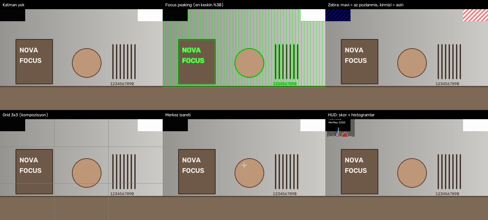

**Şekil 2.** Tenengrad katmanlarının tek tek uygulanmış hali: focus peaking, zebra pozlama uyarısı, kompozisyon ızgarası, merkez işareti ve HUD.

### Stream modunda odak kontrol modları

- **Manual** — Girilen `FocusValue` doğrudan kameraya yazılır. Zoom önce uygulanır, odak sonra: varifokal lenste zoom hareketi odağı kaydırdığı için kadraj önce kurulur.
- **One-Push Autofocus** — Kameranın kendi otofokusu bir kez tetiklenir; odaklamayı kamera yapar.
- **Closed-Loop Autofocus** — Odaklamayı paket yapar: Tenengrad skorunu tepe tırmanma ile maksimize eder, sonrasında izlemeye devam eder ve lens dışarıdan oynatıldığında aramayı kendiliğinden yeniden başlatır.

---

## 4. Girdi (Input) Parametreleri

Paket videoyu kameradan kendisi çektiği için **görüntü girdisi almaz**. Tek girdi opsiyoneldir.

### 4.1 `InputDetections` (Pydantic Model)

```python
class InputDetections(Input):
    name: Literal["inputDetections"] = "inputDetections"
    value: Optional[Union[List[Detection], Detection]] = None
    type: str = "object"

    class Config:
        title = "Detections"
```

- Tanım: Nesne tespit modelinden gelen tespitler. Verildiğinde her bounding box için ayrı bir odak skoru hesaplanır.
- Özellikler:
  - `value`: `Detection` veya `List[Detection]` — bağlı değilken `None` olabilir
  - Opsiyoneldir; bağlı olmaması paketin çalışmasını etkilemez
- Obje yapısı örneği (JSON):

```json
{
  "name": "inputDetections",
  "type": "list",
  "value": [
    {
      "boundingBox": {"left": 60, "top": 150, "width": 150, "height": 150},
      "confidence": 0.92,
      "classId": 0,
      "classLabel": "person"
    }
  ]
}
```

- Kullanıldığı modlar:
  - Tenengrad: ✅
  - Stream: ✅
  - Brenner: ➖ (bölge skoru üretmez)

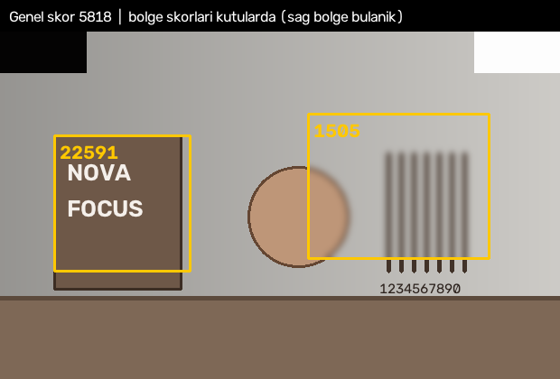

**Şekil 3.** Genel skor ile bölge bazlı skorların karşılaştırması. Sağdaki bölge bulanıklaştırılmıştır ve skoru belirgin biçimde düşüktür.

---

## 5. Konfigürasyon (Config) Parametreleri

Konfigürasyon iki gruba ayrılır: her modda görünen **kamera bağlantısı** parametreleri ve seçilen moda göre açılan **mod parametreleri**.

### 5.1 Kamera bağlantısı (her modda görünür)

#### `CameraIp`

```python
class CameraIp(Config):
    name: Literal["CameraIp"] = "CameraIp"
    value: str = ""
    type: Literal["string"] = "string"
    field: Literal["textInput"] = "textInput"
```

- Tanım: Kameranın IPv4 adresi. Paket bu adrese ONVIF ile bağlanır.
- Varsayılan: boş (zorunlu girilir)

#### `CameraUsername` / `CameraPassword`

```python
class CameraUsername(Config):
    name: Literal["CameraUsername"] = "CameraUsername"
    value: str = "admin"
    type: Literal["string"] = "string"
    field: Literal["textInput"] = "textInput"

class CameraPassword(Config):
    name: Literal["CameraPassword"] = "CameraPassword"
    value: str = ""
    type: Literal["string"] = "string"
    field: Literal["textInput"] = "textInput"
```

- Tanım: ONVIF kimlik doğrulaması için kullanıcı adı ve parola
- Varsayılan: `admin` / boş
- Not: Parola hiçbir log satırına yazılmaz; tanılama loglarında yalnızca uzunluğu görünür.

#### `CameraHttpPort`

- Tanım: Kameranın ONVIF servis portu
- Değer aralığı: 1–65535, varsayılan **80**

#### `StreamSubtype` (Dropdown)

```python
class SubtypeMain(Config):
    name: Literal["main"] = "main"
    value: Literal[1] = 1
    ...

class SubtypeSub(Config):
    name: Literal["sub"] = "sub"
    value: Literal[2] = 2
    ...
```

- Tanım: Çekilecek ONVIF medya profili. Main = 1 (yüksek çözünürlük), Sub = 2 (hafif, akıcı önizleme)
- Varsayılan: **Main**
- Not: Yalnızca videoyu etkiler, kontrolü etkilemez. Canlı önizlemede akıcılık için **Sub** önerilir.

### 5.2 `Mode` (dependentDropdownlist)

- Tanım: Paketin ne yapacağını seçer. Seçilen moda göre yalnızca o modun parametreleri açılır.
- Seçenekler: `Brenner`, `Tenengrad`, `Stream`
- Varsayılan: **Brenner**

### 5.3 Görselleştirme parametreleri (Tenengrad ve Stream modlarında)

| Parametre | Tip / Alan | Aralık | Varsayılan | Açıklama |
|-----------|-----------|--------|-----------|----------|
| `UnderExposedThreshold` | number / textInput | 0–100 | **3.0** | Bu parlaklık yüzdesinin altındaki pikseller az pozlanmış sayılır |
| `OverExposedThreshold` | number / textInput | 0–100 | **97.0** | Bu yüzdenin üstündeki pikseller aşırı pozlanmış sayılır |
| `ShowZebraWarnings` | object / dropdownlist | Enable/Disable | **Enable** | Pozlama uyarısı çizgileri |
| `ShowFocusPeaking` | object / dropdownlist | Enable/Disable | **Enable** | En keskin bölgelerin yeşil vurgusu |
| `ShowHUD` | object / dropdownlist | Enable/Disable | **Enable** | Skor ve histogram paneli |
| `ShowCenterMarker` | object / dropdownlist | Enable/Disable | **Enable** | Merkez artı işareti |
| `GridOverlay` | object / dropdownlist | None(1)/2x2/3x3/4x4/5x5 | **3x3** | Kompozisyon ızgarası |

Örnek (JSON):

```json
{
  "name": "GridOverlay",
  "type": "object",
  "field": "dropdownlist",
  "value": {"name": "grid3x3", "value": 3, "type": "number", "field": "option"}
}
```

### 5.4 Kontrol parametreleri (yalnızca Stream modunda)

#### `ZoomValue`

- Tanım: Mutlak zoom konumu. 0.0 tam geniş açı, 1.0 tam tele.
- Aralık: 0.0–1.0, varsayılan **0.0**
- Not: Üç odak modunda da geçerlidir.

#### `FocusMode` (dependentDropdownlist)

```python
class FocusModeManual(Config):
    focusValue: FocusValue
    name: Literal["manual"] = "manual"
    value: Literal["Manual"] = "Manual"
    ...

class FocusModeOnePush(Config):
    name: Literal["onePushAutofocus"] = "onePushAutofocus"
    value: Literal["OnePushAutofocus"] = "OnePushAutofocus"
    ...

class FocusModeClosedLoop(Config):
    focusSearchStep: FocusSearchStep
    name: Literal["closedLoop"] = "closedLoop"
    value: Literal["ClosedLoop"] = "ClosedLoop"
    ...
```

- Tanım: Odağın nasıl sürüleceğini seçer. Her seçenek yalnızca kendi parametresini açar:

| Odak modu | Açılan parametre | Varsayılan | Açıklama |
|-----------|------------------|-----------|----------|
| Manual | `FocusValue` (0.0–1.0) | 0.5 | Girilen odak konumu kameraya yazılır |
| One-Push Autofocus | — | — | Kameranın kendi otofokusu bir kez tetiklenir |
| Closed-Loop Autofocus | `FocusSearchStep` (0.0–1.0) | 0.02 | Tepe tırmanma adım büyüklüğü |

- Varsayılan odak modu: **Manual**

---

## 6. Çıktı (Output) Parametreleri

Dört çıktı her modda tanımlıdır; içerikleri seçilen moda göre dolar.

### 6.1 `OutputImage`

```python
class OutputImage(Output):
    name: Literal["outputImage"] = "outputImage"
    value: Union[List[Image], Image]
    type: str = "object"
```

- Tanım: İşlenmiş kare. Brenner modunda **odak haritası**, diğer modlarda katmanları çizilmiş kamera görüntüsü.

### 6.2 `OutputFocusMeasure`

```python
class OutputFocusMeasure(Output):
    name: Literal["outputFocusMeasure"] = "outputFocusMeasure"
    value: float
    type: Literal["number"] = "number"
```

- Tanım: Karenin genel odak skoru. Yüksek değer daha net görüntü anlamına gelir.

### 6.3 `OutputBboxFocusMeasures`

```python
class OutputBboxFocusMeasures(Output):
    name: Literal["outputBboxFocusMeasures"] = "outputBboxFocusMeasures"
    value: Union[dict, list]
    type: str = "object"
```

- Tanım: Her tespit kutusu için ayrı odak skoru. Tespit verilmediğinde boş liste döner.
- Not: Geçersiz (sıfır alanlı) bir kutu için liste indeksleri bozulmasın diye `NaN` yazılır.

### 6.4 `OutputCameraStatus`

```python
class OutputCameraStatus(Output):
    name: Literal["outputCameraStatus"] = "outputCameraStatus"
    value: Union[dict, list]
    type: str = "object"
```

- Tanım: Kameradan geri okunan durum ve tespit edilen yetenekler.
- Yapı örneği (JSON):

```json
{
  "name": "outputCameraStatus",
  "type": "object",
  "value": {
    "protocol": "Onvif",
    "capabilities": {"zoom": true, "focus": true, "autofocus": true},
    "focus": 0.551,
    "zoom": 0.350,
    "status": "Onvif"
  }
}
```

---

## 7. Veri Modelleri

### PackageModel hiyerarşisi

```
PackageModel (Package, type="component", name="CameraFocus")
└── configs (PackageConfigs)
    └── executor (ConfigExecutor)
        └── value (CameraFocus)
            └── value (CameraFocusRequest | CameraFocusResponse)
                ├── inputs (CameraFocusInputs)
                │   └── inputDetections (InputDetections, opsiyonel)
                ├── configs (CameraFocusConfigs)
                │   ├── cameraIp, cameraUsername, cameraPassword
                │   ├── cameraHttpPort, streamSubtype
                │   └── mode (Mode)
                │       ├── BrennerMode        -> alt parametre yok
                │       ├── TenengradMode      -> katman parametreleri
                │       └── StreamMode         -> katman parametreleri + zoomValue + focusMode
                │           └── focusMode (FocusMode)
                │               ├── Manual     -> focusValue
                │               ├── OnePush    -> alt parametre yok
                │               └── ClosedLoop -> focusSearchStep
                └── outputs (CameraFocusOutputs)
                    ├── outputImage
                    ├── outputFocusMeasure
                    ├── outputBboxFocusMeasures
                    └── outputCameraStatus
```

### Request / Response akışı

```
[Platform] --JSON Request--> [PackageModel (configs->executor->value->CameraFocusRequest)]
      |
      V
[Executor: CameraFocus] --run()
      |
      V
1. Kimlik bilgisi kontrolü (eksikse kamera yoklanmaz)
2. CameraController.read_frame()  -> RtspReader arka plan iş parçacığından en güncel kare
3. Mode'a göre ölçüm:
     Brenner   -> FocusMeasures.brenner   -> Visualization.render_brenner
     Tenengrad -> FocusMeasures.tenengrad -> OverlayRenderer.render
     Stream    -> Tenengrad + OverlayRenderer + kamera kontrolü (arka planda)
4. Kamera durumu ve yetenekleri okunur (arka plan iş parçacığı, ~saniyede bir)
5. Kare Image.set_frame ile yayınlanır
6. build_response(context) -> PackageHelper -> Response JSON
      |
      V
[Platform] <- JSON Response (outputImage, outputFocusMeasure,
                             outputBboxFocusMeasures, outputCameraStatus)
```

---

## 8. Metodoloji ve Algoritmalar

### 8.1 Brenner odak ölçüsü

- Amaç: İki piksel aralıklı yoğunluk farklarıyla ince dokuyu ölçerek netliği sayısallaştırmak

- Adımlar:
  1. Görüntü `InputGate` ile 2B uint8 gri tonlamaya normalize edilir
  2. `int16` tipine çevrilir
  3. Yatay fark hesaplanır: `piksel[x+2] - piksel[x]`
  4. Dikey fark hesaplanır: `piksel[y+2] - piksel[y]`
  5. Farklar pozitif kısma kırpılır (yalnızca artışlar)
  6. İki farkın eleman bazlı maksimumu alınır ve karesi hesaplanır
  7. Odak matrisi ve ortalaması (genel skor) döndürülür

- Pseudo-code:

```python
def brenner(image):
    gray = InputGate.to_grayscale_uint8(image).astype(np.int16)
    dh = np.zeros(gray.shape, np.int32)
    dv = np.zeros(gray.shape, np.int32)
    dh[:, :-2] = gray[:, 2:] - gray[:, :-2]
    dv[:-2, :] = gray[2:, :] - gray[:-2, :]
    np.clip(dh, 0, None, out=dh)
    np.clip(dv, 0, None, out=dv)
    focus_matrix = np.maximum(dh, dv) ** 2
    return focus_matrix, focus_matrix.mean()
```

- Uygulama notu: Ara diziler `int32` olarak ayrılır; referans uygulamadaki `float64` seçimi küçük tamsayı farkları için gereksiz bellek harcar.

### 8.2 Tenengrad odak ölçüsü

- Amaç: Sobel gradyan büyüklükleriyle kenar keskinliğini ölçmek

- Adımlar:
  1. Görüntü gri tonlamaya normalize edilir
  2. `cv2.Sobel` ile yatay (gx) ve dikey (gy) gradyanlar hesaplanır (3×3, CV_32F)
  3. `gx² + gy²` yerinde (in-place) hesaplanır
  4. Matrisin ortalaması genel skoru verir
  5. Tespit verilmişse her kutu için ayrı ortalama hesaplanır

- Pseudo-code:

```python
def tenengrad(image, detections=None):
    gray = InputGate.to_grayscale_uint8(image)
    gx = cv2.Sobel(gray, cv2.CV_32F, 1, 0, ksize=3)
    gy = cv2.Sobel(gray, cv2.CV_32F, 0, 1, ksize=3)
    focus_measure = gx
    np.square(focus_measure, out=focus_measure)
    np.square(gy, out=gy)
    np.add(focus_measure, gy, out=focus_measure)
    overall = float(focus_measure.mean())
    per_box = [region_mean_or_nan(focus_measure, d) for d in (detections or [])]
    return gray, focus_measure, overall, per_box
```

- Optimizasyon notları:
  - Ara dizi ayrılmaması için `np.square` / `np.add` `out=` parametresiyle kullanılır
  - Karekök alınmaz: sıralamayı değiştirmez, yalnızca zaman harcar

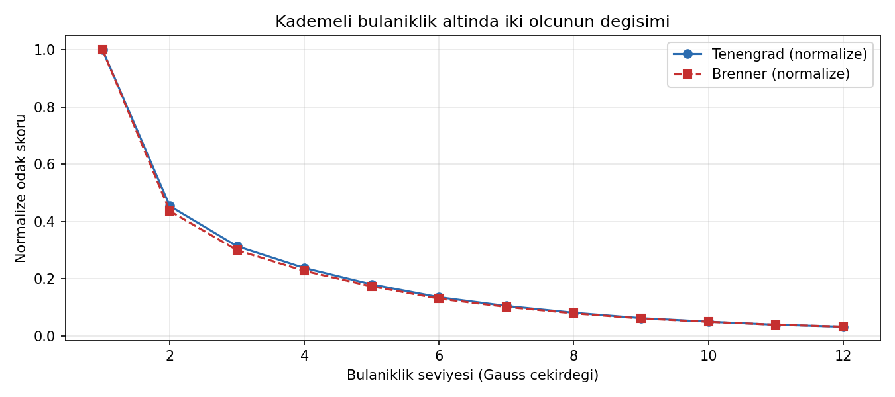

**Şekil 4.** Kademeli bulanıklık altında iki ölçünün değişimi. Her iki ölçü de bulanıklık arttıkça hızla düşer.

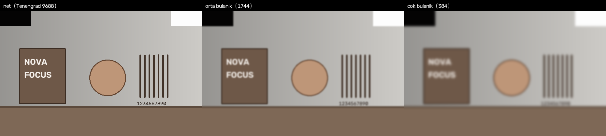

**Şekil 5.** Aynı sahnenin net, orta bulanık ve çok bulanık halleri ile ölçülen skorlar.

### 8.3 Skorun ölçek bağımlılığı

Odak skorunun mutlak bir anlamı yoktur. Değer; sahnedeki doku yoğunluğuna, çözünürlüğe ve aydınlatmaya göre değişir. Bu nedenle:

- Sabit bir eşik ("skor 5000'in altındaysa bulanık") **kameradan kameraya taşınamaz**
- Eşik, kurulumun kendi sahnesinde net ve bulanık örnekler toplanarak kalibre edilmelidir
- Kapalı-döngü otofokus bu sorundan etkilenmez; **mutlak değeri değil, göreli değişimi** kullanır

### 8.4 Görselleştirme katmanları

| Katman | Yöntem | Not |
|--------|--------|-----|
| Focus peaking | Odak matrisinin **yüzdelik** eşiği (varsayılan en keskin %30) | Referans uygulamadaki "maksimumun %30'u" yaklaşımının düzeltilmiş hali |
| Zebra | Diyagonal şerit maskesi; eşik altı mavi, üstü kırmızı | Yalnızca maskelenen piksellerde harmanlama yapılır |
| HUD | Skor, parlaklık istatistikleri ve histogramlar | Renk kanalları **ortak maksimuma** göre normalize edilir |
| Grid | 2×2 – 5×5 kompozisyon çizgileri | `None` seçildiğinde çizim yapılmaz |
| Merkez işareti | Çözünürlüğe göre ölçeklenen artı işareti | 720 piksel referansına göre ölçeklenir |

Katman sırası: **focus peaking → zebra → merkez → grid → HUD**. Pozlama kırpılması geri döndürülemez bir kayıp olduğu için zebra uyarısının yeşil vurgu tarafından örtülmemesi gerekir.

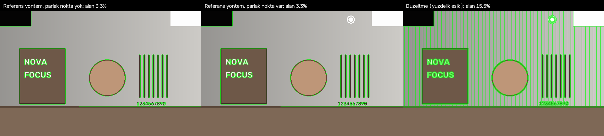

**Şekil 6.** Sahneye küçük bir parlak nokta eklendiğinde iki yöntemin davranışı. Referans yöntemde eşik maksimuma bağlı olduğu için boyanan alan neredeyse yok olur; yüzdelik eşikte oran korunur.

### 8.5 Kapalı-döngü otofokus

- Amaç: Kameranın kendi otofokusuna bağlı kalmadan, Tenengrad skorunu maksimize eden odak konumunu bulmak

- Adımlar:
  1. Mevcut odak konumu okunur ve bir yönde adım atılır
  2. Skor iyileşiyorsa aynı yönde, aynı adımla devam edilir
  3. Skor gürültü bandı içinde kalırsa karar verilmez; adım küçültülmeden aynı yönde denemeye devam edilir
  4. Skor bandın açıkça altına düşerse tepe geçilmiş demektir: yön çevrilir ve adım yarıya indirilir
  5. Adım `min_step` değerinin altına inince en iyi konuma park edilir ve yakınsama işaretlenir
  6. Yakınsama sonrasında izlemeye devam edilir

- Pseudo-code:

```python
def step(controller, score, state, zoom):
    if state["converged"]:
        if lens_moved_externally(controller, state):   # birincil tetikleyici
            rearm(state)
        elif smoothed(score) < state["best_score"] * 0.88 for N frames:
            rearm(state)                               # ikincil tetikleyici
        return state
    if score > state["best_score"]:
        keep_direction_and_step()
    elif score >= state["best_score"] * (1 - noise_margin):
        keep_probing_without_halving()
    else:
        reverse_direction(); halve_step()
    controller.set_focus(next_position)
    return state
```

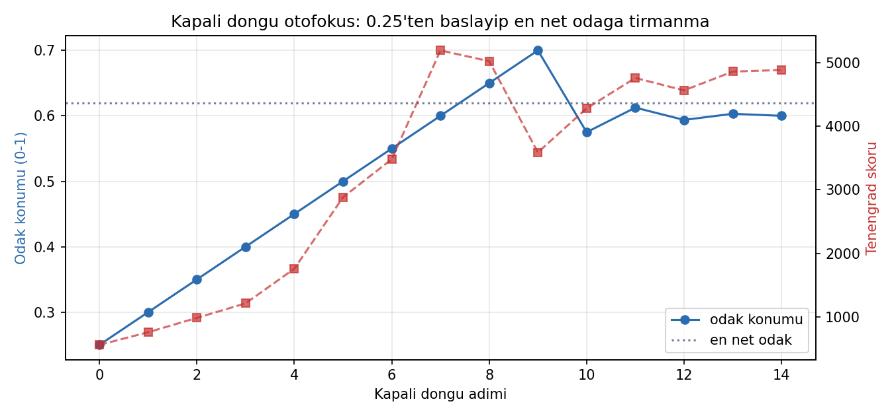

**Şekil 7.** Kapalı-döngü otofokusun 0.25 konumundan başlayıp en net odağa tırmanışı; mavi eğri odak konumunu, kırmızı eğri odak skorunu gösterir.

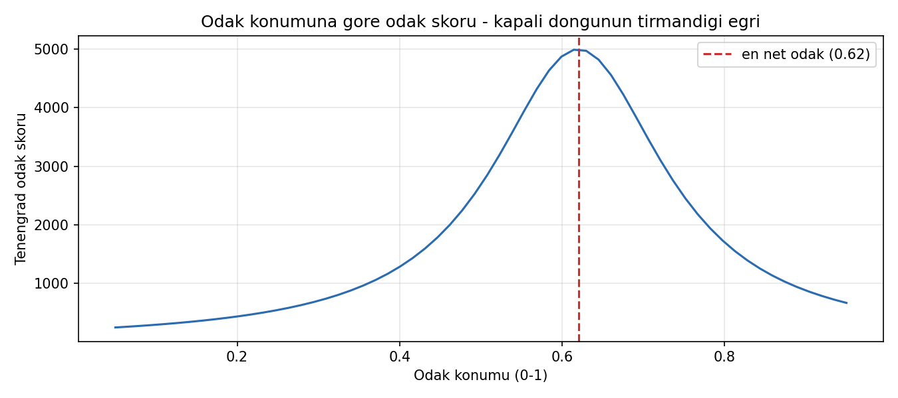

**Şekil 8.** Döngünün üzerinde tırmandığı odak-skor eğrisi. Tepe noktası en net odak konumudur.

### 8.6 Otomatik yeniden odaklanma

Yakınsama sonrası paket iki tetikleyiciyi izler:

1. **Lens konumu kayması (birincil).** Odak, paketin park ettiği konumdan `drift_tolerance` (0.05) değerinden fazla uzaklaşmışsa, odağı paket dışında biri değiştirmiş demektir ve arama yeniden başlatılır.
2. **Skor düşüşü (ikincil).** Yumuşatılmış skor, ulaşılan en iyi skorun %88'inin altında birkaç kare boyunca kalırsa arama yeniden başlatılır. Bu tetikleyici sahne değişimlerini yakalar.

Konum tabanlı tetikleyicinin birincil olmasının nedeni ölçülmüştür: Tenengrad skoru sahne içeriğine bağlı olarak %10'dan fazla dalgalanır ve odak elle bozulduğunda skor mutlaka düşmez. Dolayısıyla yalnızca skora bakan bir eşik bu durumu güvenilir biçimde yakalayamaz.

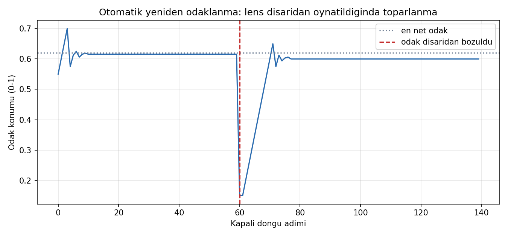

**Şekil 9.** Lens dışarıdan bozulduğunda paketin durumu algılayıp en net odağa geri dönmesi.

### 8.7 Kamera kontrolü (ONVIF)

| İşlem | Yöntem | Not |
|-------|--------|-----|
| Video adresi | Media `GetStreamUri` | Kimlik bilgileri okuyucuya verilmeden önce adrese eklenir |
| Zoom | PTZ `AbsoluteMove` | Desteklenmeyen kameralarda zamanlı sürekli hareket yedeği |
| Odak | Imaging **relative** hareket | Mutlak ve sürekli hareket yedek olarak kullanılır |
| Otofokus | Imaging `AutoFocusMode` | Manuel ve kapalı-döngü modlarda kapatılır |
| Yetenek tespiti | `GetServices` / `GetMoveOptions` | Desteklenmeyen kontroller sessizce atlanır |

Odak için **relative** hareketin tercih edilmesinin nedeni ölçüme dayanır: test edilen kamerada mutlak ve sürekli odak komutları zoom motorunu sıfırlarken, relative hareket zoom'a dokunmaz ve 1:1 ölçekte çalışır.

### 8.8 Gerçek kamera üzerinde doğrulama

Aşağıdaki kareler, paket platformda çalışırken canlı kameradan alınmıştır. Odak kademeli olarak iyileştikçe HUD panelindeki Tenengrad skorunun yükseldiği görülmektedir.

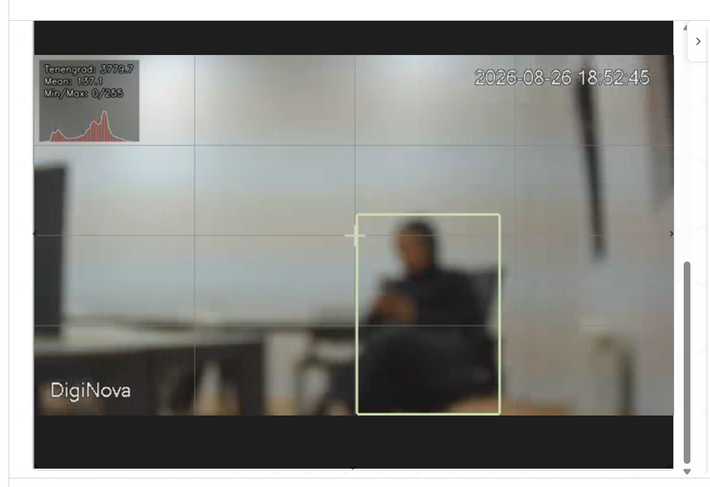

**Şekil 10.** Odak bozukken: Tenengrad **3779.7**. Görüntüdeki kenarlar belirgin biçimde yumuşaktır.

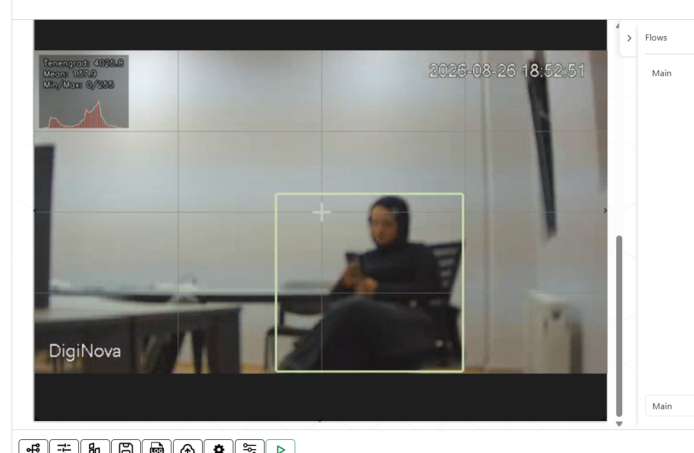

**Şekil 11.** Odak kısmen düzeltildiğinde: Tenengrad **4025.8**.

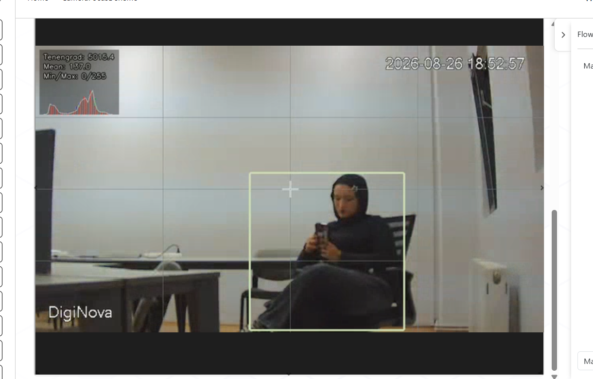

**Şekil 12.** Odak tam netleştiğinde: Tenengrad **5015.4**. Skor, görsel netlikle tutarlı biçimde en yüksek değerine ulaşmıştır.

Bu üç kare, ölçünün pratikte beklendiği gibi davrandığını göstermektedir: odak iyileştikçe skor monoton biçimde artmaktadır. Kapalı-döngü otofokus da tam olarak bu artışı takip ederek en yüksek skorun bulunduğu konuma yönelir.

### Avantajlar

- ✅ Tek executor: kamera bilgileri bir kez girilir, mod değiştirmek bağlantıyı koparmaz
- ✅ ONVIF sayesinde markadan bağımsız çalışma
- ✅ Kamera kontrolü arka planda yürütüldüğü için canlı önizleme yavaşlamaz
- ✅ Gürültüye dayanıklı tepe tırmanma: arama başladığı noktadan uzaklaşabilir
- ✅ Lens dışarıdan oynatıldığında otomatik toparlanma
- ✅ Kamera yetenekleri otomatik tespit edilir; desteklenmeyen kontroller hata üretmez
